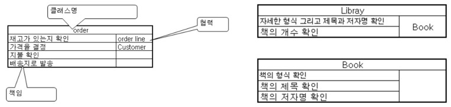

# 모놀리스 분해하기

## 왜 분해하나?
- 나쁜 구조: 응집력 낮음, 무관한 코드 뭉치들
- 변경의 속도: 변경하면 전체 코드 재배포 필요, 일부 모듈 변경에 대한 부담
- 팀 구조: 팀이 물리적으로 분리되어 있을 경우 분해하는 것이 관리 측면에서 편함
- 보안: 민감한 데이터의 보호를 강화하기 쉬움
- 기술: 기존 기술에 얽매이지 않고 독립적으로 서비스 구성 가능

## 어떻게 분해하나?
1. 서비스의 경계가 될 수 있는 접합부를 찾고, 이를 패키지 등으로 분리하기
    - `접합부`(seam): 코드베이스의 나머지 부분에 영향을 주지 않는 격리된 코드 부분
        * `경계가 있는 콘텍스트`는 훌륭한 접합부를 만듦
    - 콘텍스트를 대표하는 `패키지 관계`는 `실제 도메인 관계`와 같아야 한다.
    - 접합부를 인식했을 때 해당 부분이 시스템의 나머지 부분과 어떻게 얽혀 있나 확인해야 함 (의존성은 낮을수록 좋음)
    - 대개 DB에서 의존성이 뒤엉켜 있음
        * 코드 자체를 확인
        * DB에 Read, Write하는 부분 확인
        * 하나의 테이블이 다수의 경계가 있는 콘텍스트에서 사용된다면? `데이터베이스 리팩토링`
            1. 외부 키 관계를 깨뜨려서 결합 깨기 (성능은 트레이드 오프)
            2. 공유 정적 데이터를...
                + 코드로 다룬다 ex. `enum`
                + 각 패키지에 테이블 복제 (일관성 문제)
                + 독립적인 서비스로 분리 (too much)
            3. 공유 변경 가능 데이터를 독립적인 서비스로 분리
                + 추상화된 개념을 만들고 그를 API로 노출시키는 과정에서 이루어짐 
            4. 공유 테이블은 테이블을 분리
        * 서비스 구조보다 스키마를 우선 변경하면서 단계적으로 작은 변경을 계속할 것
        * 스키마의 변경은 트랜잭션의 일관성을 깨뜨린다. 안정성을 보장하려면?
            1. 나중에 재시도 (큐/로그 파일에 큐잉. 시스템이 스스로 일관성 유지함.)
            2. 전체 작업 중지 (시스템 원복 -> 재시도. 작업이 많아지면 어렵다.)
            3. 분산 트랜잭션 (여러 트랜잭션을 통제하는 "트랜잭션 관리자" 개념. "2단계 커밋"으로 투표 후 커밋. 제대로 적용하기 어렵다.)
            4. 애초에 정말 필요한지부터 확인하고, 일관성 보장이 정말 필요하면 처음부터 분리되지 않도록 하는 게 최선. 만약 불가피하게 분리된 트랜잭션이 되었다면, "진행 중인 주문" 같은 구체적 단계를 만들면 모니터링하기 좋다.
2. 계속 분리하다 보면 그래도 분리 못한 것들이 남는다. 이게 간과한 콘텍스트일 수 있다.
    - 이 과정들은 `천천히 조금씩` 이루어지고, 이를 서포트하기 위한 다양한 도구가 있다.
    - 왜 `천천히 조금씩`? 변경의 영향도를 이해하는 것이 필요. 실수한다면, 낮은 영향도의 실수부터 하는 게 좋다.
    - 추천 도구: [CRC 카드](https://uiandwe.tistory.com/465)로 영향도 점검
    - 

## 리포팅
- 데이터 저장 장소를 분리하면, 여러 부분의 데이터를 모아야 하는 리포팅이 어려워진다
- 모놀리스는 리포팅 만들기는 쉽지만... 단점
    1. 스키마 변경에 부담
    2. 리포팅 지원을 위해 DB 최적화 방법에 제한
    3. 여러 DB들이 있는데 대안 적용에 제한
- 솔루션?
    * 서비스 호출을 통한 데이터 추출 (배치 API 등)
    * 데이터 펌프 (리포팅 시스템이 데이터를 가져오는 게 아니라, 리포팅 시스템에 데이터를 밀어넣음 / 리포팅 스키마 결합 문제 있음)
    * 이벤트 데이터 펌프 (원본 시스템의 DB와 결합하는 게 아니라, 발생한 이벤트와 결합 / 정기적 배치보다 빠름 / 모든 데이터의 이벤트화?)
    * 백업 데이터 펌프 (넷플릭스. 표준 데이터 저장소 이외에 백업 저장소를 둠. 백업으로 리포팅함.)
    * 실시간? 리포트 분야별로 필요한 기술 요소가 다름. 필요에 따라 다양한 곳으로 라우팅하게.

## 정리
- 모놀리스는 적절한 시점까지는 유지되어도 좋다. 변경 비용이 너무 커지기 전에 분리되면 된다.
- 드러난 서비스 경계에 따라 접합부를 찾아서 점진적 방법으로 시스템을 분해하자.
- 접합부의 발견이 능숙해지고, 처음부터 변경 비용이 작고, 신규 요구 사항을 쉽게 반영할 수 있도록 시스템을 성장시키자.
- 힘들 수 있지만, 두려워할 것까지는 없다.